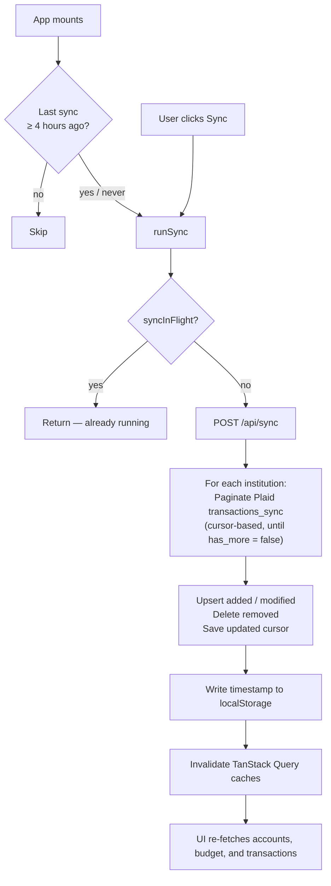

# coin-log

A personal finance tracking application integrating with [Plaid](https://plaid.com/) for bank and transaction data, with a built-in monthly budgeting system.

---

## Stack

### Backend

- **Flask 3** — lightweight HTTP server with modular blueprint routing
- **SQLite + SQLAlchemy** — local database, no external server needed
- **plaid-python** — official Plaid SDK (v16+)
- **python-dotenv** — environment variable management

### Frontend

- **Vite** — build tool and dev server (port 5173, proxies `/api` → Flask 5000)
- **React 19 + TypeScript**
- **Mantine** — UI component library
- **TanStack Query v5** — server state and cache management
- **@tabler/icons-react** — icon library
- **react-plaid-link** — official Plaid Link React hook

---

## Project Structure

```
backend/
  app.py              # Flask app factory; registers 5 blueprints
  config.py           # Plaid client singleton — reads PLAID_* env vars
  db.py               # SQLAlchemy models, with_session decorator, and init_db()
  utils.py            # Shared helpers: get_by_model_id, validate_month
  routes/
    accounts.py       # /api/accounts
    budgets.py        # /api/budgets/<month>, /api/budget-items
    institutions.py   # /api/institutions
    plaid.py          # /api/create_link_token, /api/set_access_token
    transactions.py   # /api/transactions, /api/sync
  services/
    accounts.py
    budgets.py        # Budget logic + default category seeding
    institutions.py
    plaid.py
    transactions.py
  requirements.txt
  .env.example

frontend/
  vite.config.ts
  src/
    main.tsx          # MantineProvider + QueryClientProvider
    App.tsx           # Route navigation + sidebar state; calls useSyncInit()
    api.ts            # All typed fetch calls (single source of truth)
    queryClient.ts    # TanStack Query singleton (staleTime: Infinity)
    components/
      AccountsList.tsx
      BudgetCategoryCard.tsx
      BudgetItemDetails.tsx
      DataTable.tsx
      Header.tsx
      LinkButton.tsx        # usePlaidLink wrapper
      Sidebar.tsx
      TransactionDetailModal.tsx
      UncategorizedPanel.tsx
    hooks/
      syncStore.ts          # runSync() + useSyncInit() for auto-sync on mount
      useBudgetSummary.ts
      useSidebar.ts
    pages/
      AccountsPage.tsx
      BudgetPage.tsx
      TransactionsPage.tsx
    utils/
      date.ts
```

---

## Database Schema

| Table               | Key Columns                                                                                                                                                                                          |
| ------------------- | ---------------------------------------------------------------------------------------------------------------------------------------------------------------------------------------------------- |
| `institutions`      | `id` (PK), `access_token`, `connection_type`, `last_synced_at`, `logo_url`, `name`, `plaid_item_id`, `sync_cursor`                                                                                   |
| `accounts`          | `id` (PK), `institution_id` (FK), `current_balance`, `is_manual`, `mask`, `name`, `plaid_account_id`, `subtype`, `type`                                                                              |
| `transactions`      | `id` (PK), `account_id` (FK), `amount`, `budget_item_id` (FK), `category`, `check_number`, `date`, `is_deleted`, `merchant_name`, `name`, `note`, `pending`, `plaid_transaction_id`, `type_override` |
| `budgets`           | `id` (PK), `month` (YYYY-MM, unique)                                                                                                                                                                 |
| `budget_categories` | `id` (PK), `budget_id` (FK), `name`                                                                                                                                                                  |
| `budget_items`      | `id` (PK), `budget_category_id` (FK), `name`, `planned_amount`                                                                                                                                       |

Transaction `type` is derived at read time from the `amount` sign (`< 0` → income, `> 0` → expense), overridable via `transactions.type_override`. Category type (income vs expense) is determined at read time by checking whether the category name is `"Income"`.

---

## API Endpoints

| Endpoint                            | Method | Purpose                                                                 |
| ----------------------------------- | ------ | ----------------------------------------------------------------------- |
| `/api/create_link_token`            | POST   | Creates Plaid Link token for the frontend                               |
| `/api/set_access_token`             | POST   | Exchanges public token, stores Institution + Accounts in DB             |
| `/api/sync`                         | POST   | Fetches transactions from all institutions via Plaid                    |
| `/api/institutions`                 | GET    | Returns all linked institutions                                         |
| `/api/institutions/<id>/sync`       | POST   | Syncs a single institution                                              |
| `/api/institutions/<id>`            | DELETE | Disconnects institution and cascade-deletes its data                    |
| `/api/accounts`                     | GET    | Returns all accounts                                                    |
| `/api/accounts`                     | POST   | Creates a manual account                                                |
| `/api/accounts/<id>`                | PATCH  | Updates an account                                                      |
| `/api/accounts/<id>`                | DELETE | Deletes an account                                                      |
| `/api/transactions`                 | GET    | Returns transactions (filterable by month, account, etc.)               |
| `/api/transactions`                 | POST   | Creates a manual transaction                                            |
| `/api/transactions/<id>`            | PATCH  | Updates a transaction (pass `is_deleted: true` to soft-delete)          |
| `/api/transactions/<id>`            | DELETE | Hard-deletes a transaction                                              |
| `/api/transactions/<id>/assignment` | POST   | Assigns a transaction to a budget item                                  |
| `/api/transactions/<id>/assignment` | DELETE | Removes a transaction's budget item assignment                          |
| `/api/budgets/<month>`              | GET    | Returns budget summary; 404 if no budget exists for that month          |
| `/api/budgets/<month>`              | POST   | Creates a budget for the month (copies from previous or seeds defaults) |
| `/api/budget-items`                 | POST   | Creates a new budget item                                               |
| `/api/budget-items/<id>`            | PATCH  | Updates a budget item                                                   |
| `/api/budget-items/<id>`            | DELETE | Deletes a budget item                                                   |

---

## Budget System

`POST /api/budgets/<month>` seeds 7 default categories on first creation:

| Category       | Type    | Default Items                              |
| -------------- | ------- | ------------------------------------------ |
| Income         | income  | Paycheck                                   |
| Savings        | expense | Emergency Fund, Investments                |
| Housing        | expense | Home Maintenance, Mortgage/Rent, Utilities |
| Transportation | expense | Car Insurance, Gas                         |
| Food           | expense | Groceries, Restaurants                     |
| Personal       | expense | Entertainment, Shopping, Subscriptions     |
| Health         | expense | Gym, Medical                               |

If a budget already exists for the previous month, that month's categories and planned amounts are copied instead. Category names are fixed; budget items within categories are user-editable (create / update / delete).

Transactions are assigned to budget items explicitly by the user; only assigned transactions (those with a `budget_item_id`) count toward spending. The budget summary at `GET /api/budgets/<month>` returns planned, spent, and remaining amounts per item.

The `BudgetPage` renders a `BudgetPageHeader` sub-component that always shows the month nav (← month →); the summary text and view-mode toggle (Planned / Remaining / Spent) only appear when a budget exists for the selected month.

---

## Sync Flow



---

## Getting Started

### Backend

```bash
cd backend
cp .env.example .env        # fill in PLAID_CLIENT_ID and PLAID_SECRET
pip install -r requirements.txt
flask run                   # http://localhost:5000
```

### Frontend

```bash
cd frontend
yarn install
yarn dev                    # http://localhost:5173
```

Both must be running. The Vite dev server proxies all `/api` requests to Flask.

---

## User Flow

1. App loads → auto-syncs if last sync was more than 4 hours ago
2. Click **Connect Bank** → Plaid Link modal opens
3. Complete the bank connection → Institution and Accounts are stored in DB
4. Transactions sync automatically; click **Sync** on the Transactions page for a manual refresh
5. **Budget tab** — navigate months, create a budget for the month, view category cards, assign uncategorized transactions to budget items
6. **Transactions tab** — browse, filter, and manage all transactions
7. **Accounts tab** — view linked and manual accounts
